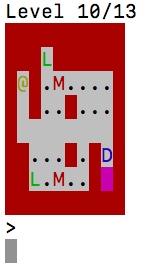

# Installation #
## Dependencies ##
- Python 3.3+
- [colorama](https://pypi.python.org/pypi/colorama) v. 0.3.9+

# Running the game #
The game can be run with `./run.sh`. There is no support for Windows at the moment.
Colorama will be installed for the user on launch if it's not found.

# Images #

